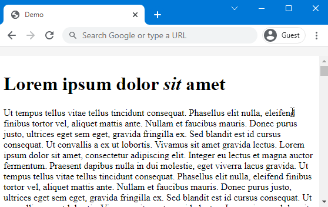

# Brancher.js
[](http://commitizen.github.io/cz-cli/)

**A drop-in tool to show the current page position with regards to the table of content on an HTML page.**

It creates a clickable navbar that dynamically displays the current `<h[1-6]>`-tags tree branch. It has been created to keep track of the current position in the table of contents inside long markdown files, but can be used in other HTML pages as well.



## Usage
Simply include `brancher.js` inside your markdown or HTML page.

⚠️ _Note that some editors or web providers (e.g. GitHub) disallow the execution of javascript inside markdown files. Compile them into HTML to circumvent this._

_.md_
```markdown
<script src="../src/brancher.js" type="text/javascript"></script>
# Title
Some content
## Subtitle
...
```

_.html_
```html
<!DOCTYPE html>
<html>
    <head>
        <title>Demo</title>

        <!-- Include brancher.js -->
        <script src="../src/brancher.js" type="text/javascript"></script>

    </head>
    <body>
        ...
```

## Limitations
`brancher.js` copies all the body content and place it in a scrollable `<div>`. The new body contains brancher container and the body-content container.

This approach may cause issues with the behavior of the page.

-----

## Development

### Git commit linter
#### Installation
For the commit linter you need to install:
- [commitlint](https://github.com/conventional-changelog/commitlint)
    - `npm install --global @commitlint/cli @commitlint/config-conventional`
- [husky](https://github.com/typicode/husky)
    - `npm install --global husky`
    - `npx husky install`
- [commitizen (cz)](https://github.com/commitizen/cz-cli)
    - `npm install --global commitizen @commitlint/cz-commitlint`

#### Usage
For commit linter, commit as usual, and the linter will run via git hooks.

To generate a good commit message use:
`npx cz`
